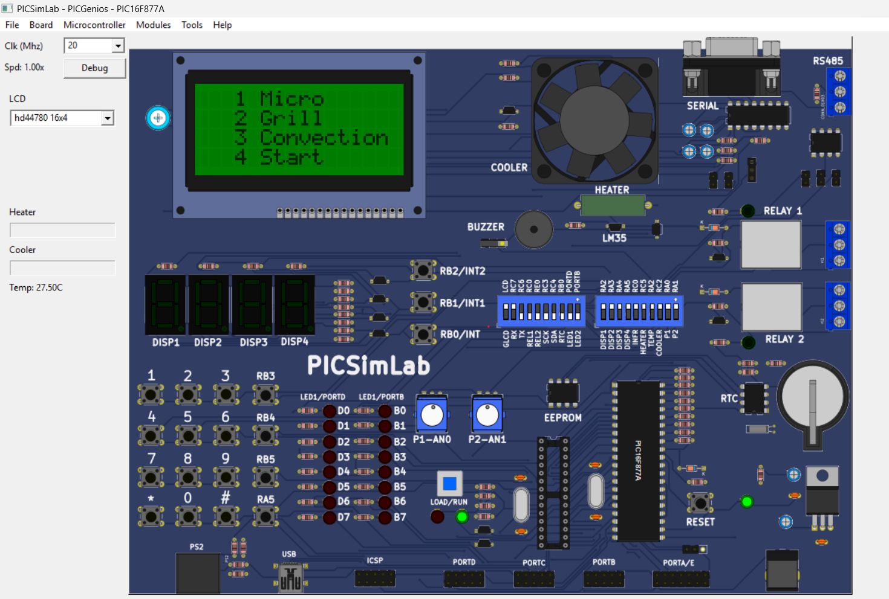

# Microwave Oven Controller using PIC16F877A

## Overview

An embedded C-based microwave oven controller developed using the PIC16F877A microcontroller. The system provides multiple cooking modes and user controls through a matrix keypad and CLCD.

## Features

- Micro mode
- Grill mode
- Convection mode
- Start, Pause and Stop controls
- Cooking time configuration
- Temperature configuration
- CLCD-based user interface
- Timer and interrupt-based control

## Technologies Used

- PIC16F877A Microcontroller
- Embedded C
- CLCD
- Matrix Keypad
- Timers
- Interrupts
- PICSimLab

## Project Structure

src/
├── main.c
├── micro_oven.c
├── micro_oven.h
├── clcd.c
├── clcd.h
├── matrix_keypad.c
├── matrix_keypad.h
├── timers.c
├── timers.h
└── isr.c

results/
└── Simulation and output images

## Working

The PIC16F877A processes keypad inputs and controls the microwave operating modes. The CLCD displays the selected mode, cooking time and temperature. Timers and interrupts are used for real-time control and timing operations.

## Simulation Result

